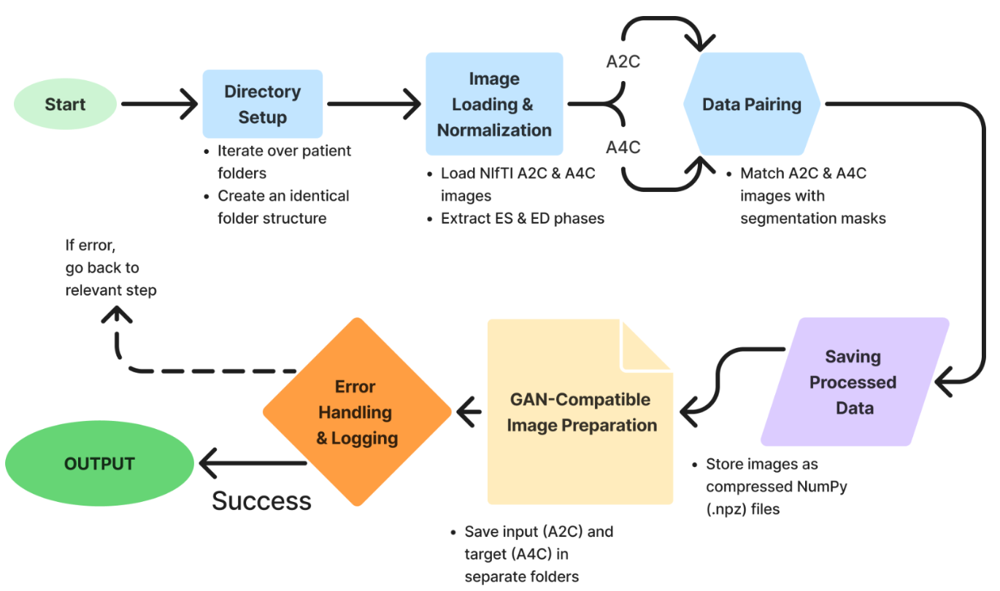
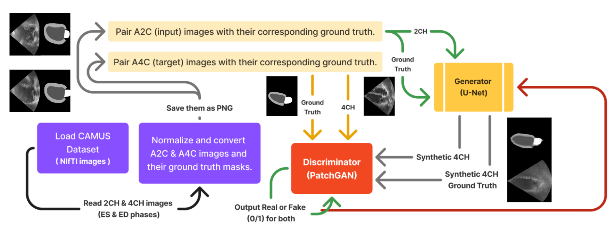

# GAN-EchoViewTransform

## 📌 Project Overview
GAN-EchoViewTransform is a deep learning project that utilizes Generative Adversarial Networks (GANs) to transform echocardiographic views. This project specifically focuses on converting between different echocardiographic views, that is **A2C (Apical 2-Chamber) to A4C (Apical 4-Chamber)**, with an emphasis on segmentation mask generation (Ground Truth).

## 🔬 Research Motivation
Obtaining high-quality annotated data is a challenge. Echocardiography is a critical tool for heart disease diagnosis. However, obtaining high-quality, annotated A4C (Apical 4-Chamber) views from A2C (Apical 2-Chamber) views remains a challenge due to the limited availability of annotated datasets and the underutilization of synthetic data in medical imaging.

A possible question may arise: **Instead of generating A4C, why not train an AI model to directly label A2C images?**  
- A2C lacks the right atrium (RA) and right ventricle (RV), making it less comprehensive for diagnosis.  
- Training an AI on A2C alone results in poor generalization due to imaging variability.  
- Since A4C is clinically preferred, generating it from A2C improves diagnostic usability and AI model performance.  

---

## 🚀 Features
✔ **GAN-based View Transformation** – Converts A2C images to A4C and vice versa.  
✔ **Segmentation-Aided Approach** – Uses pre-trained segmentation models for guidance.  
✔ **Multiple Loss Functions** – Implementations of **SSIM+PSNR, SSIM+PSNR+DICE, BCE+L1, L1+Perception, Dice+L1, Att+BCE+L1, Att+Dice+L1**.  
✔ **Colab-Compatible** – Implemented across multiple Google Colab notebooks.  
✔ **Dataset Handling & Preprocessing** – Reads and processes NIfTI files, normalizes, and prepares for GAN training.

---

## 🛠️ Methodology
We used **multiple Colab notebooks** to test different loss functions and training techniques:
1. **SSIM+PSNR Notebook:** Measures perceptual similarity and pixel-level differences.
2. **FID Notebook:** Evaluates the realism of generated images.
3. **SSIM+PSNR+DICE Notebook:** Adds segmentation-based loss.
4. **Att+BCE+L1 Notebook:** Incorporates attention mechanisms with BCE and L1 loss.
5. **Dice+L1 Notebook:** Focuses on segmentation and pixel-level accuracy.
6. **BCE+L1 Notebook:** Balances pixel-wise accuracy and smoothness.
7. **L1+Perception Notebook:** Uses perceptual loss to capture structural details.
8. **Att+Dice+L1 Notebook:** Integrates attention with segmentation and pixel-based loss.

Each model was trained separately to ensure stability, and the best-performing approach was selected for final integration.

---

## 📂 Dataset Preparation

- We use echocardiographic images in **NIfTI format**.
- Images are normalized to a range of `[0,1]`.
- GAN-compatible preprocessing scales images to `[-1,1]`.
- Paired data (A2C → A4C) is prepared for supervised learning.

**Example Preprocessing Steps:**
```python
import nibabel as nib
import numpy as np

def load_nifti(file_path):
    nifti_img = nib.load(file_path)
    img_data = nifti_img.get_fdata()
    img_data = (img_data - img_data.min()) / (img_data.max() - img_data.min())  # Normalize to [0,1]
    return img_data
```

---

## ⚙ Model Architecture
The project follows the standard **GAN structure**:

### **1️⃣ Generator**
- Uses a **U-Net-inspired architecture** to generate A4C from A2C.
- Learns transformations with segmentation-guided features.
- Implements loss functions to refine predictions.

### **2️⃣ Discriminator**
- A PatchGAN-based **binary classifier**.
- Determines whether the generated image is real or synthetic.

---

## 🧢 Training Process
- **Loss Function Comparisons:**
  - **SSIM+PSNR:** Measures image similarity.
  - **FID:** Evaluates realism of synthetic images.
  - **SSIM+PSNR+DICE:** Adds segmentation-based improvement.
  - **BCE+L1:** Balances pixel-wise accuracy and smoothness.
  - **L1+Perception:** Captures structural differences.
  - **Dice+L1:** Helps with segmentation-based quality.
  - **Att+BCE+L1:** Attention-enhanced BCE+L1.
  - **Att+Dice+L1:** Combines attention with segmentation and pixel-wise losses.
- **Training Steps:**
  1. Preprocess dataset.
  2. Train GAN using different loss functions.
  3. Evaluate results using **PSNR, SSIM, Dice Coefficient, and FID**.

---

## 📊 Results & Evaluation
| Loss Functions  | No. of Patients, Epochs | PSNR | Avg SSIM | FID |
|---------------|----------------------|------|---------|------|
| BCE + L1     | 400, 300             | 30.83 dB | 0.6069  | 46.26 |
| Perceptual + L1 | 400, 300             | 30.82 dB | 0.6205  | 51.35 |
| Dice + L1    | 400, 300             | 30.86 dB | 0.6403  | 120.50 |
- **Higher PSNR & SSIM indicate better perceptual quality.**
- **Higher Dice Score means better segmentation alignment.**
- **Lower FID score means more realistic generation.**

---

## 📀 How to Use
### **1️⃣ Clone the Repository**
```sh
git clone https://github.com/yourusername/GAN-EchoViewTransform.git
cd GAN-EchoViewTransform
```

### **2️⃣ Install Dependencies**
```sh
pip install -r requirements.txt
```

### **3️⃣ Run Training**
Modify `train.py` with dataset paths and run:
```sh
python train.py --epochs 100 --batch_size 8
```

### **4️⃣ Evaluate Model**
Run evaluation script to compare different loss functions:
```sh
python evaluate.py
```

---

## 📝 Future Improvements
🔹 Extend to more echocardiographic views.  
🔹 Optimize model size for real-time inference.  
🔹 Experiment with diffusion models for further improvements.  

---

## 👥 Collaborators
- [Siddarth Singh](https://github.com/siddharth02004)
- [Agrim Raj](https://github.com/username3)
- [Ayushman Soni](https://github.com/AyushmanSoni)

---

## 📢 Contact
For questions or collaborations, feel free to reach out via **[soniayushman012@gmail.com](mailto:soniayushman012@gmail.com)**

---

🎯 **If you found this useful, don't forget to ⭐ star the repo!** 🚀
